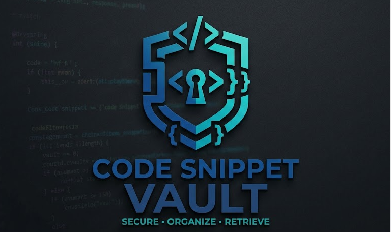

<div align="center">
  

  <h1>Code Snippet Vault</h1>
  <p>A fast, local, and secure developer utility to store, organize, and retrieve your reusable code snippets.</p>
</div>

<br>

<div align="center">
  
  
  
  
  
</div>

<br>

## 🚀 Overview
**Code Snippet Vault** is a decoupled Single Page Application (SPA) built for developers who need a quick, distraction-free environment to save pieces of code. Run it entirely on your local machine—no cloud syncing, no subscriptions, no bloat.

## ✨ Features
- **Create & Edit:** Quickly save code blocks with syntax highlighting.
- **Auto-Versioning:** Never lose your work. The system automatically saves the last 10 versions of your code when you edit a snippet.
- **Smart Organization:** Group snippets into Collections, apply fluid custom Tags, and mark your most used snippets as Favorites.
- **Instant Export:** One-click copy buttons for raw code or formatted Markdown ready for GitHub/Jira.
- **Dark Mode:** Native Dark/Light mode syncing with your OS preferences.

## 🛠 Tech Stack
- **Backend API:** Laravel 11 (PHP 8.2+)
- **Database:** MySQL 8.0
- **Frontend UI:** React 18, built with Vite
- **Styling:** Bootstrap 5
- **Code Highlighting:** `react-syntax-highlighter`

## 📚 Documentation & Architecture
Extensive project documentation can be found in the root directory:
- `documentation/requirements.md` - Functional and Non-Functional Specs
- `documentation/walkthrough.md` - User Manual
- `documentation/final-documentation.md` - Deep dive into architecture and API design
- `diagrams/` - 15 Mermaid.js diagrams illustrating schemas, workflows, and use cases.

## 🏁 Getting Started

### 1. Database & Backend
```bash
cd backend
composer install
cp .env.example .env
php artisan key:generate

# Make sure you have a local MySQL database named `code_snippet_vault`
# and update your .env with your DB credentials

php artisan migrate --seed
php artisan serve
```
The API will be available at `http://localhost:8000/api`.

### 2. Frontend
Open a new terminal window:
```bash
cd frontend
npm install
npm run dev
```
The UI will be available at `http://localhost:5173`.

---
<div align="center">
  <i>Built as a local learning project.</i>
</div>
