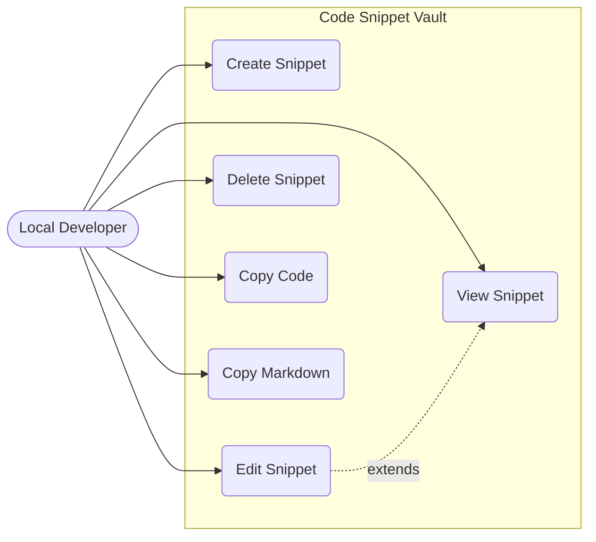

```mermaid
flowchart LR
    User([Local Developer])
    
    subgraph "Code Snippet Vault"
        UC1(Create Snippet)
        UC2(View Snippet)
        UC3(Edit Snippet)
        UC4(Delete Snippet)
        UC5(Copy Code)
        UC6(Copy Markdown)
    end
    
    User --> UC1
    User --> UC2
    User --> UC3
    User --> UC4
    User --> UC5
    User --> UC6
    
    UC3 -.->|extends| UC2
```
