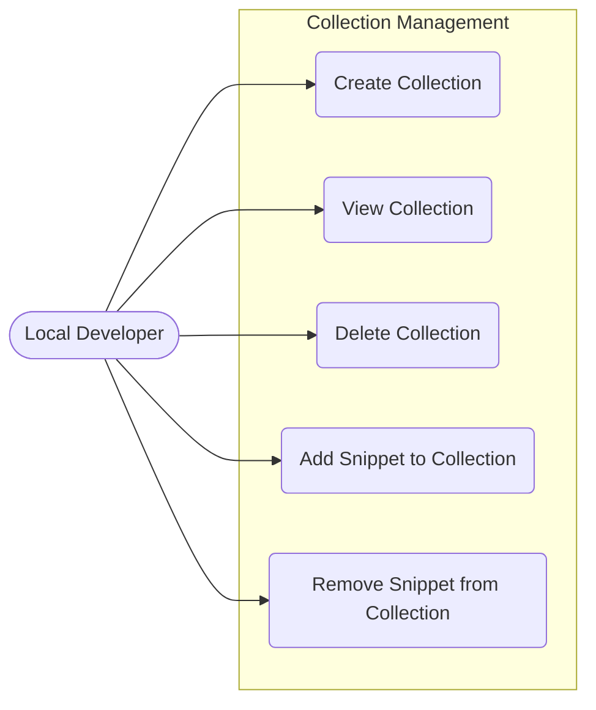

```mermaid
flowchart LR
    User([Local Developer])
    
    subgraph "Collection Management"
        UC1(Create Collection)
        UC2(View Collection)
        UC3(Delete Collection)
        UC4(Add Snippet to Collection)
        UC5(Remove Snippet from Collection)
    end
    
    User --> UC1
    User --> UC2
    User --> UC3
    User --> UC4
    User --> UC5
```
