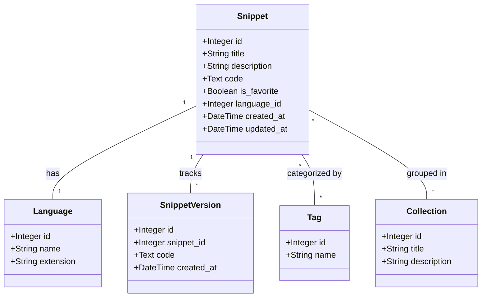

```mermaid
classDiagram
    class Snippet {
        +Integer id
        +String title
        +String description
        +Text code
        +Boolean is_favorite
        +Integer language_id
        +DateTime created_at
        +DateTime updated_at
    }
    
    class Language {
        +Integer id
        +String name
        +String extension
    }
    
    class Tag {
        +Integer id
        +String name
    }
    
    class Collection {
        +Integer id
        +String title
        +String description
    }
    
    class SnippetVersion {
        +Integer id
        +Integer snippet_id
        +Text code
        +DateTime created_at
    }

    Snippet "1" -- "1" Language : has
    Snippet "1" -- "*" SnippetVersion : tracks
    Snippet "*" -- "*" Tag : categorized by
    Snippet "*" -- "*" Collection : grouped in
```
