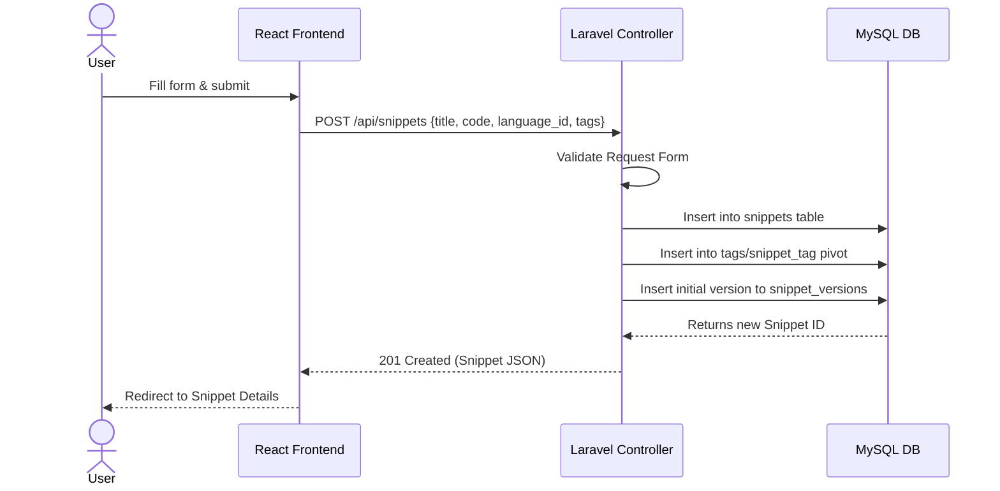

```mermaid
sequenceDiagram
    actor User
    participant UI as React Frontend
    participant API as Laravel Controller
    participant DB as MySQL DB

    User->>UI: Fill form & submit
    UI->>API: POST /api/snippets {title, code, language_id, tags}
    API->>API: Validate Request Form
    API->>DB: Insert into snippets table
    API->>DB: Insert into tags/snippet_tag pivot
    API->>DB: Insert initial version to snippet_versions
    DB-->>API: Returns new Snippet ID
    API-->>UI: 201 Created (Snippet JSON)
    UI-->>User: Redirect to Snippet Details
```
