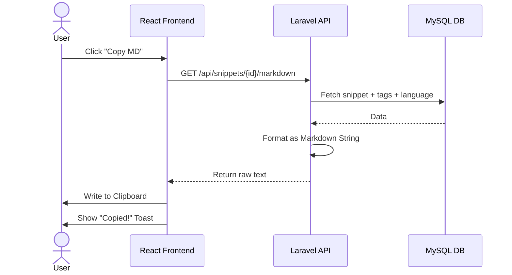

```mermaid
sequenceDiagram
    actor User
    participant UI as React Frontend
    participant API as Laravel API
    participant DB as MySQL DB

    User->>UI: Click "Copy MD"
    UI->>API: GET /api/snippets/{id}/markdown
    API->>DB: Fetch snippet + tags + language
    DB-->>API: Data
    API->>API: Format as Markdown String
    API-->>UI: Return raw text
    UI->>User: Write to Clipboard
    UI->>User: Show "Copied!" Toast
```
