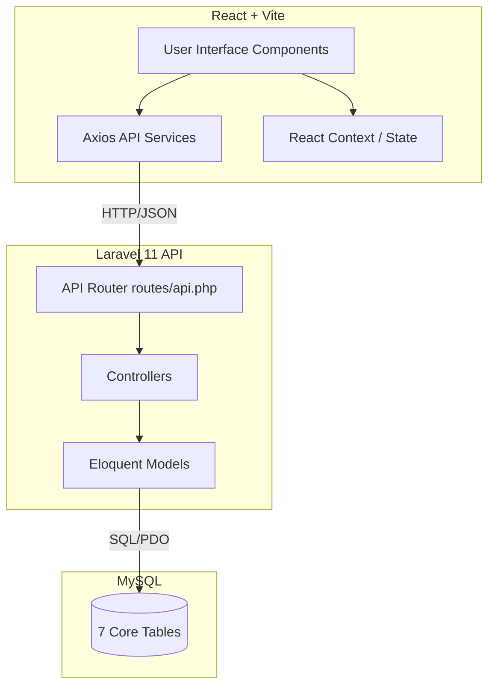

```mermaid
flowchart TD
    subgraph Frontend [React + Vite]
        UI[User Interface Components]
        Services[Axios API Services]
        State[React Context / State]
        
        UI --> State
        UI --> Services
    end

    subgraph Backend [Laravel 11 API]
        Router[API Router routes/api.php]
        Controllers[Controllers]
        Models[Eloquent Models]
        
        Router --> Controllers
        Controllers --> Models
    end

    subgraph Database [MySQL]
        Tables[(7 Core Tables)]
    end

    Services -- HTTP/JSON --> Router
    Models -- SQL/PDO --> Tables
```
