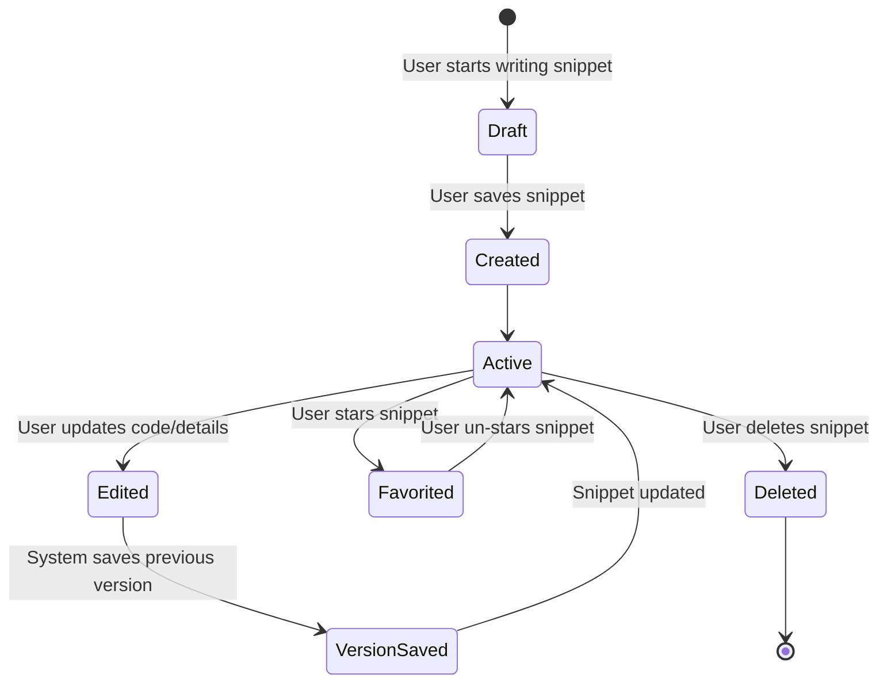

```mermaid
stateDiagram-v2
    [*] --> Draft: User starts writing snippet
    Draft --> Created: User saves snippet
    Created --> Active
    
    Active --> Edited: User updates code/details
    Edited --> VersionSaved: System saves previous version
    VersionSaved --> Active: Snippet updated
    
    Active --> Favorited: User stars snippet
    Favorited --> Active: User un-stars snippet
    
    Active --> Deleted: User deletes snippet
    Deleted --> [*]
```
