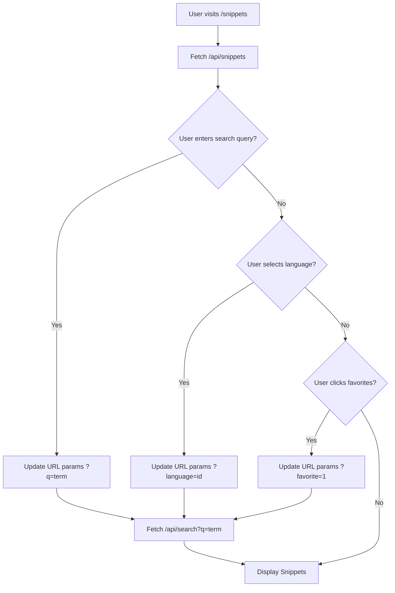

```mermaid
flowchart TD
    Start[User visits /snippets] --> Fetch[Fetch /api/snippets]
    
    Fetch --> Search{User enters search query?}
    Search -- Yes --> UpdateURL[Update URL params ?q=term]
    UpdateURL --> ReFetch[Fetch /api/search?q=term]
    Search -- No --> FilterLang{User selects language?}
    
    FilterLang -- Yes --> UpdateURLLang[Update URL params ?language=id]
    UpdateURLLang --> ReFetch
    FilterLang -- No --> FilterFav{User clicks favorites?}
    
    FilterFav -- Yes --> UpdateURLFav[Update URL params ?favorite=1]
    UpdateURLFav --> ReFetch
    FilterFav -- No --> End[Display Snippets]
    
    ReFetch --> End
```
