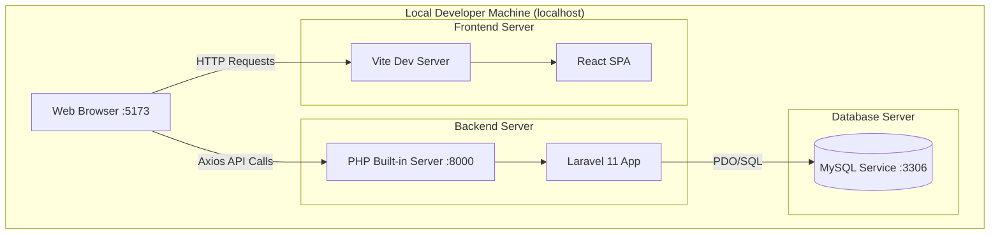

```mermaid
flowchart TD
    subgraph "Local Developer Machine (localhost)"
        Browser[Web Browser :5173]
        
        subgraph "Frontend Server"
            Vite[Vite Dev Server]
            React[React SPA]
            Vite --> React
        end
        
        subgraph "Backend Server"
            PHP[PHP Built-in Server :8000]
            Laravel[Laravel 11 App]
            PHP --> Laravel
        end
        
        subgraph "Database Server"
            MySQL[(MySQL Service :3306)]
        end
        
        Browser -- HTTP Requests --> Vite
        Browser -- Axios API Calls --> PHP
        Laravel -- PDO/SQL --> MySQL
    end
```
