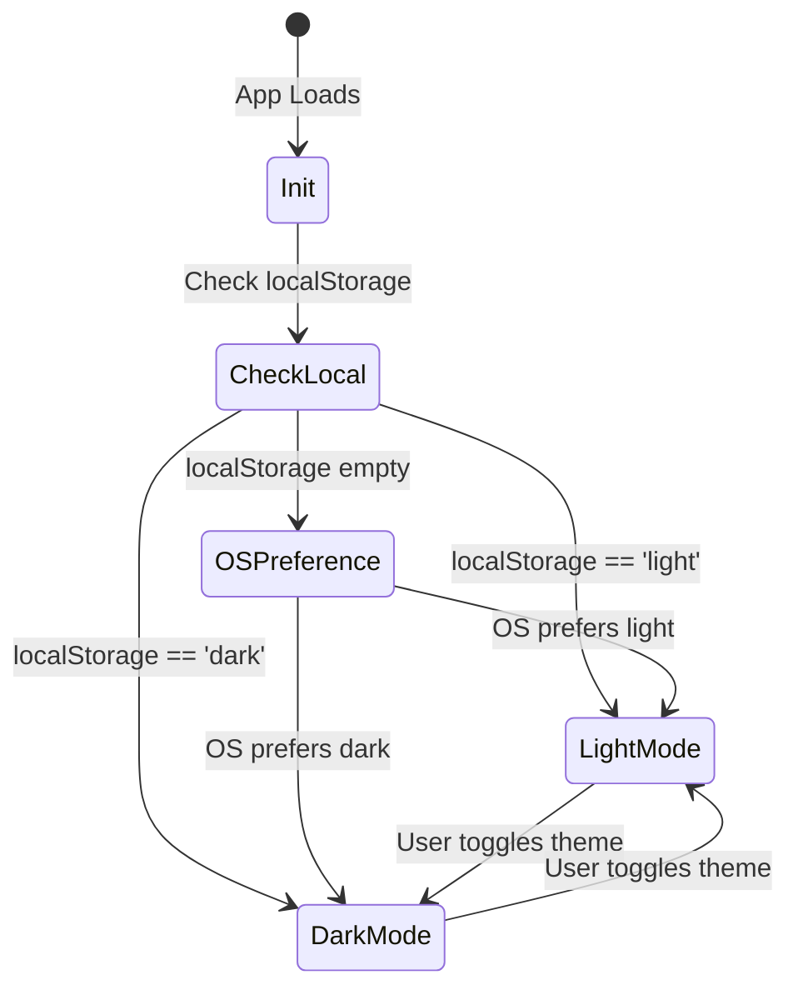

```mermaid
stateDiagram-v2
    [*] --> Init: App Loads
    
    Init --> CheckLocal: Check localStorage
    CheckLocal --> LightMode: localStorage == 'light'
    CheckLocal --> DarkMode: localStorage == 'dark'
    CheckLocal --> OSPreference: localStorage empty
    
    OSPreference --> DarkMode: OS prefers dark
    OSPreference --> LightMode: OS prefers light
    
    LightMode --> DarkMode: User toggles theme
    DarkMode --> LightMode: User toggles theme
```
