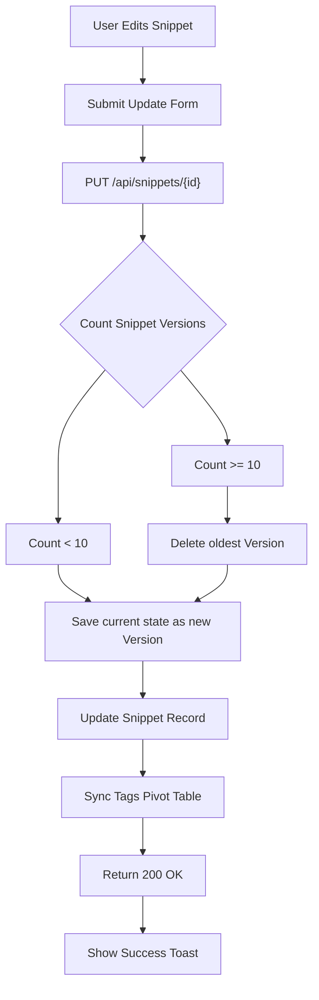

```mermaid
flowchart TD
    Start[User Edits Snippet] --> Submit[Submit Update Form]
    Submit --> API["PUT /api/snippets/{id}"]
    
    API --> CheckVersions{Count Snippet Versions}
    CheckVersions --> LessThan10["Count < 10"]
    CheckVersions --> AtLeast10["Count >= 10"]
    
    LessThan10 --> SaveVersion[Save current state as new Version]
    AtLeast10 --> DeleteOldest[Delete oldest Version]
    DeleteOldest --> SaveVersion
    
    SaveVersion --> UpdateSnippet[Update Snippet Record]
    UpdateSnippet --> UpdateTags[Sync Tags Pivot Table]
    UpdateTags --> Return[Return 200 OK]
    Return --> UI[Show Success Toast]
```
