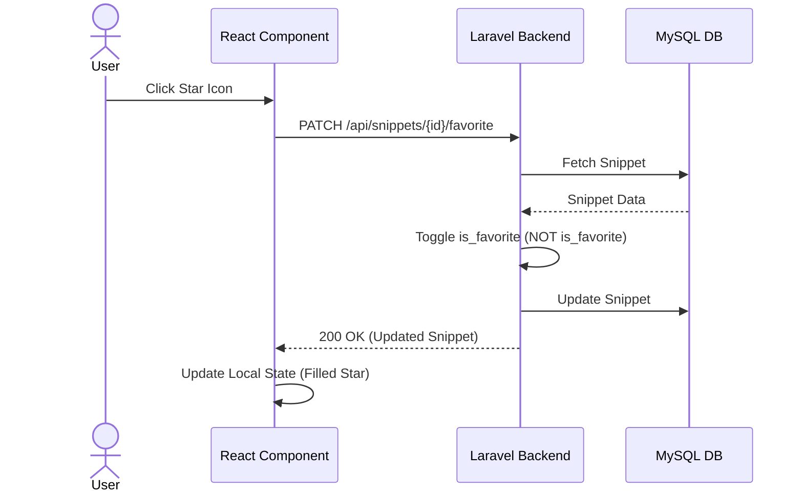

```mermaid
sequenceDiagram
    actor User
    participant UI as React Component
    participant API as Laravel Backend
    participant DB as MySQL DB

    User->>UI: Click Star Icon
    UI->>API: PATCH /api/snippets/{id}/favorite
    API->>DB: Fetch Snippet
    DB-->>API: Snippet Data
    API->>API: Toggle is_favorite (NOT is_favorite)
    API->>DB: Update Snippet
    API-->>UI: 200 OK (Updated Snippet)
    UI->>UI: Update Local State (Filled Star)
```
