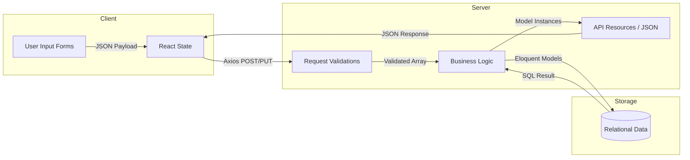

```mermaid
flowchart LR
    subgraph Client
        React[React State]
        Form[User Input Forms]
    end
    
    subgraph Server
        Req[Request Validations]
        Logic[Business Logic]
        Format[API Resources / JSON]
    end
    
    subgraph Storage
        MySQL[(Relational Data)]
    end

    Form -->|JSON Payload| React
    React -->|Axios POST/PUT| Req
    Req -->|Validated Array| Logic
    Logic -->|Eloquent Models| MySQL
    MySQL -->|SQL Result| Logic
    Logic -->|Model Instances| Format
    Format -->|JSON Response| React
```
